### Theory

**Inheritance:**

-  Inheritance in Java describes IS-A relationship. It is a mechanism by which one object acquires all the properties and behaviors of parent object.

-  Extends keyword is used to describe inheritance in Java.

-  When a class extends another class it inherits all the non-private member functions and methods.

-  Inheritance describes a parent-child or a super class-subclass relationship.

-  Inheritance provides code reusability.

-  Syntax of inheritance:

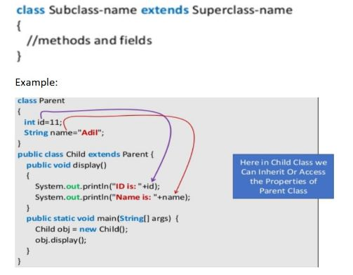

Memory allocation for object of derived class:

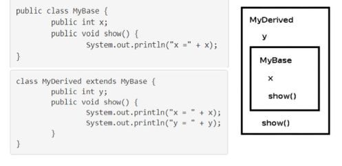

Concepts related to inheritance:

1. Generalization: In OO models, some classes may have common characteristics. We extract these features into a new class and inherit original class from this new class.

Consider the three classes:


They have a common abstraction called the Shape. Apply generalization as follows:

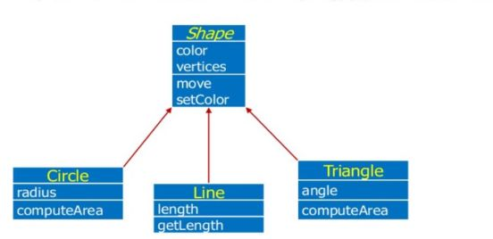

2. Subtyping: Subtyping means the derived class is behaviorally compatible with the base class. Behaviorally compatible means the base class can be replaced by derived class.

3. Specialization: Specialization means the derived class is behaviorally incompatible with the base class. Behaviorally compatible means the base class cannot be replaced by derived class.

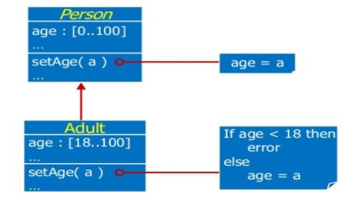

**Types of Inheritance:***

1.  Single inheritance: When a class extends one class only then we call it single inheritance.


2.  Multilevel inheritance

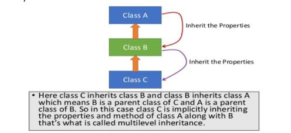

3.  Hierarchical inheritance: in this inheritance multiple classes inherits from a single class i.e there is one super class and multiple sub classes, As we can see from the below diagram when a same class is having more than one sub class (or) more than one sub class has the same parent is called as hierarchical inheritance,

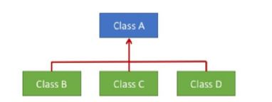

4. Multiple inheritance: In Java programming, multiple and hybrid inheritance is not supported through interface only.

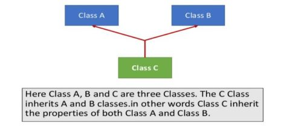

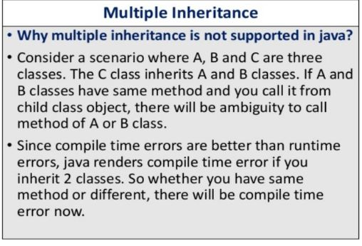

5. Hybrid inheritance: Any combination of previous three inheritance (single, hierarchical, and multilevel) is called as hybrid inheritance.

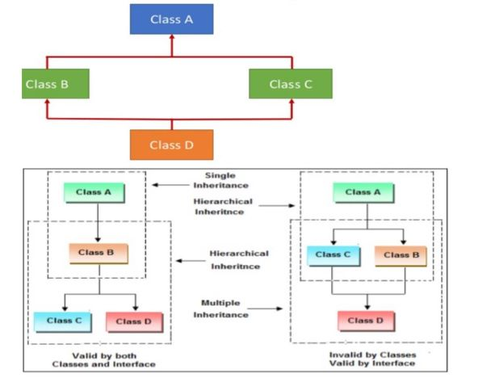

**Access control in derived class:**

A derived class can access all the non-private members of its base class. Thus base-class members that should not be accessible to the members of derived classes should be declared private in base class.


Access specifiers and inheritance:

Access control keywords define which classes can access classes, methods, and members.

The following rules for inherited methods are enforced:

1. Methods declared public in a superclass also must be public in all subclasses.

2. Methods declared public in a superclass also must be public in subclasses; they cannot be private.

3. Methods declared private are not inherited at all, so there is no rule for them.

The table of access control for various specifiers is as follows:

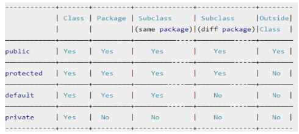

**Super Keyword:**

1. Super with Variables: when a derived class and base class has same data members.
```
/* Base class vehicle */ 

class Vehicle 
{
int maxspeed=120;
}

/* Driver program to test */
class Test
{
public static void main(String[] args)
{

Car small = new Car();
small.display():

}
}

/* sub class Car extending vehicle */
class Car extends Vehicle
{
    int maxSpeed = 180;
void display()
{

/* print maxSpeed of base
class (vehicle) */

System out printin(Maximum
Speed: " + super maxSpeed).


}
}
```
2. Use of super with methods: when we want to call parent class method. So whenever a parent and child class have same named methods then to resolve ambiguity we use super keyword.

```
/* Base class Person */
class Person

{
    void message() { 
        System out printi(This is person class"); }
}


/*Subclass Student*/
class Student extends Person

{

void message() { System out println("This s studentclass"); }

//Note that display() is only in Student class
void display() {

message(); // will invoke or call current class message() method
super.message(); // wil invoke or call parent class message() method
}


```

3. Use of super with constructors: super keyword can also be used to access the parent class constructor. One more important thing is that, ‘’super’ can call both parametric as well as non-parametric constructors depending upon the situation. Call to super() must be first statement in Derived Class constructor.

**Method overloading:**

A concept in Java which allows programmer to declare method with same name but different behavior. Methods with same name co-exists in same class but they must have different method signature. It is resolved using static binding at compile time.

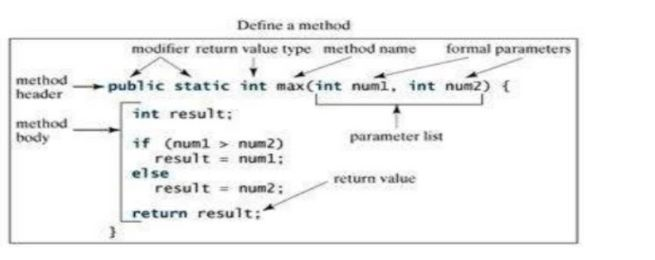

To change signature, either change number of argument, type of argument or order of argument. Since return type is not part of methods signature changing return type will result in duplicate method and you will get compile time error in Java.

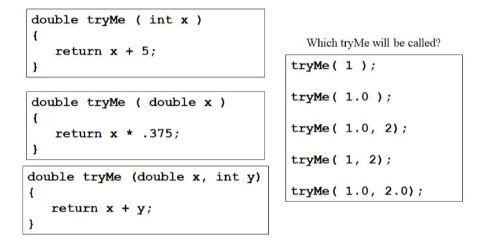